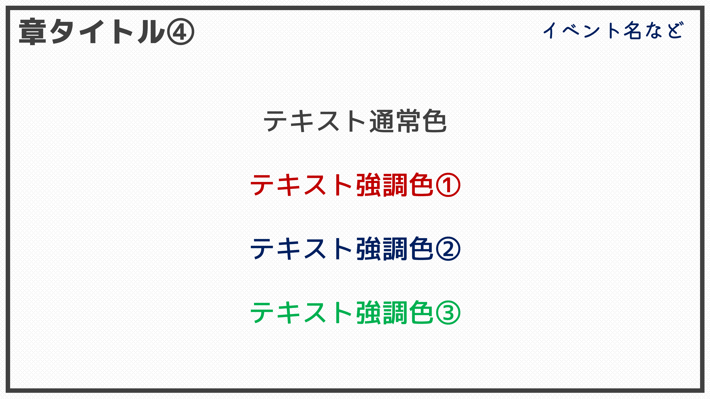

# SenagaStandard_ver.1
## 説明
瀬長がスライド発表を行う際、一般的に用いるスライドその1です。 
難しいデザインを使用していないため、比較的軽量、かつ汎用的にご利用いただけます。

### 推奨フォント
- M+ 2p (https://mplus-fonts.osdn.jp/about2.html)
- マメロン Hi-Regular (https://moji-waku.com/mamelon/)

どちらもフリーフォントです。

### 代替フォント
- 游ゴシック Medium(Boldにすると、太字も見栄えが良くなります。) ・ 游ゴシック ・ 游ゴシック Light

## スクリーンショット
### タイトル

### アジェンダ

### コンテンツ

### 手順説明

### 使用フォントサイズ

### 使用カラー

### まとめ・あとがき

 
 

## 更新履歴
2023/08/11 初版を公開