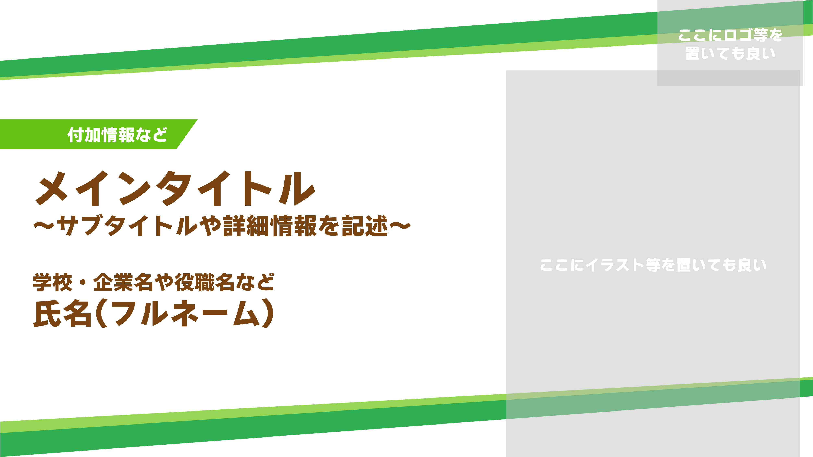
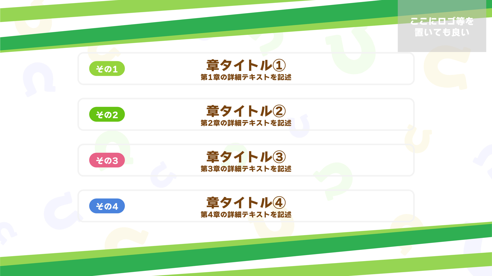
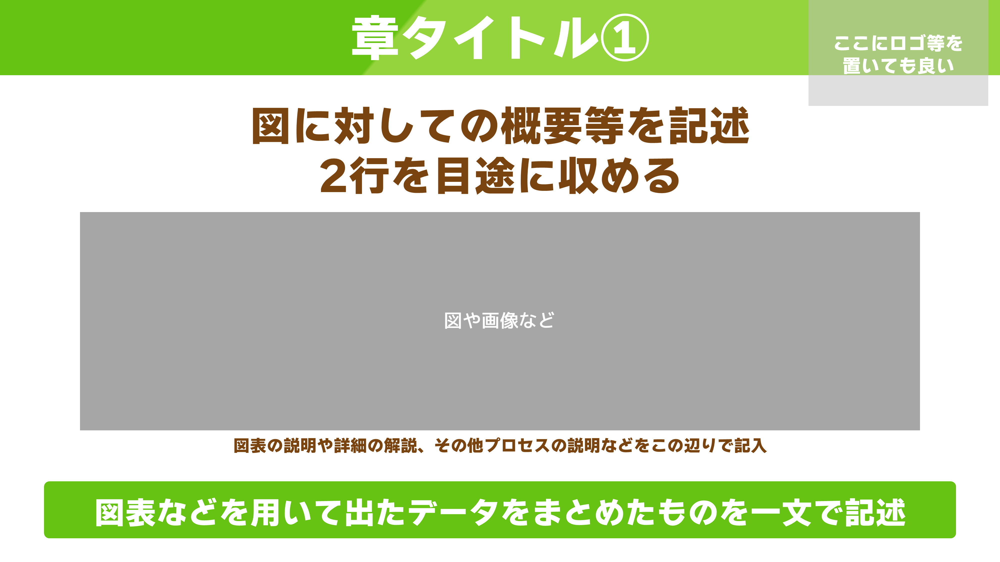
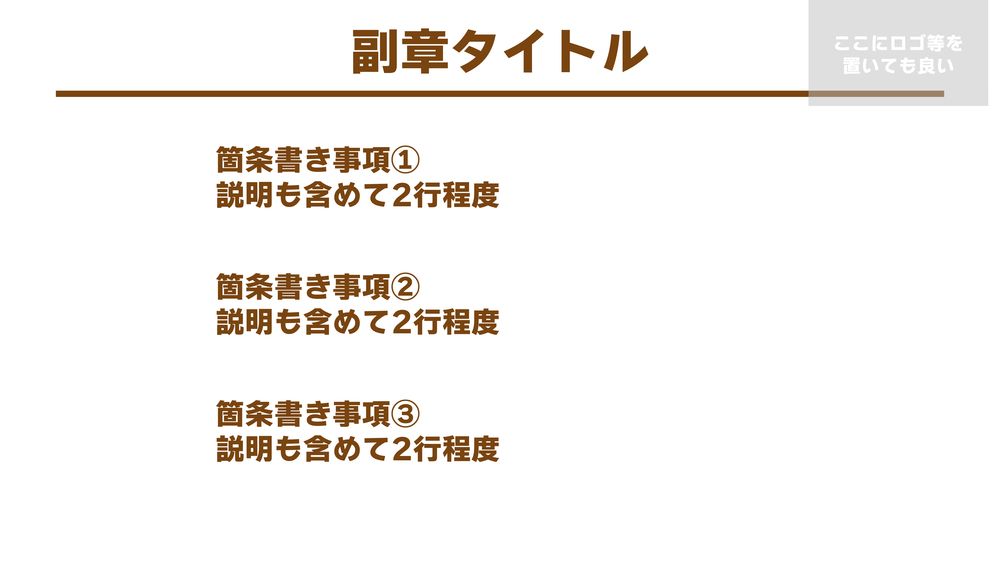
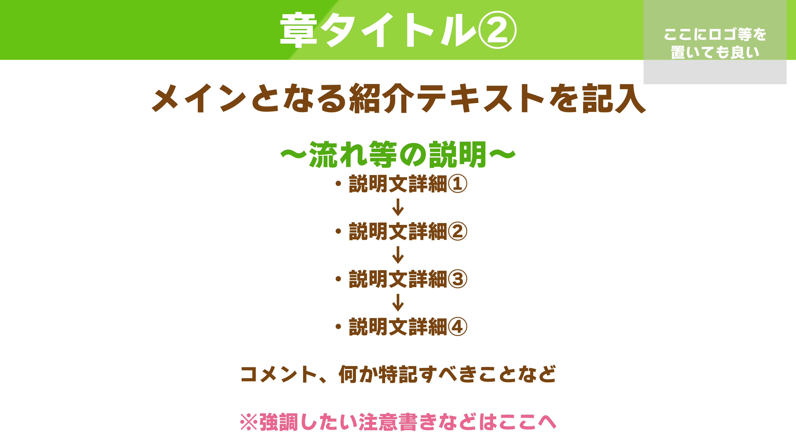
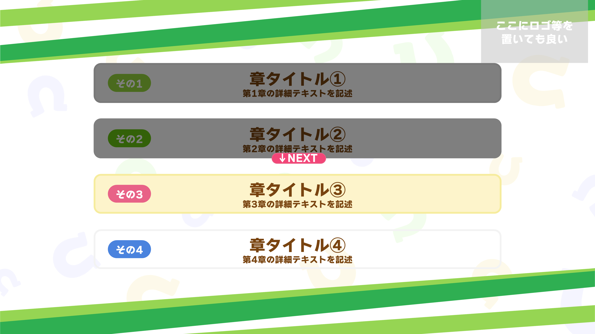
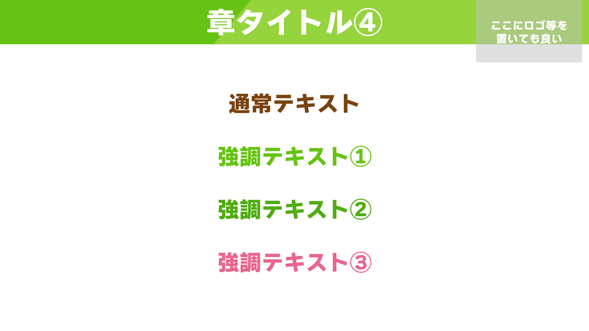

# UmamusumeStyle
## 説明
ウ◯娘プリティーダービーのゲーム画面風スライドです。 
有料フォントを用いていますが、使用フォントはその1種類のみです。 
オタク向けのネタ系発表に使いやすいですが、Cygames様の技術資料から着想を得ているデザインもあるため、一応は多方面に使えると思います。多分。

### 推奨フォント
- わんぱくルイカ-07 (https://booth.pm/ja/items/1104324)

※有料フォントです。

### 代替フォント
- M+ 2p heavy (https://mplus-fonts.osdn.jp/about2.html)

※再現性は何とも言えません

## スクリーンショット
### タイトル
||
|:---|
### アジェンダ
||
|:---|
### コンテンツ
||
|:---|
### サブコンテンツ
||
|:---|
### 手順説明
||
|:---|
### 使用フォントサイズ
||
|:---|
### 使用カラー
||
|:---|

 
 

## 更新履歴
2023/08/11 初版を公開